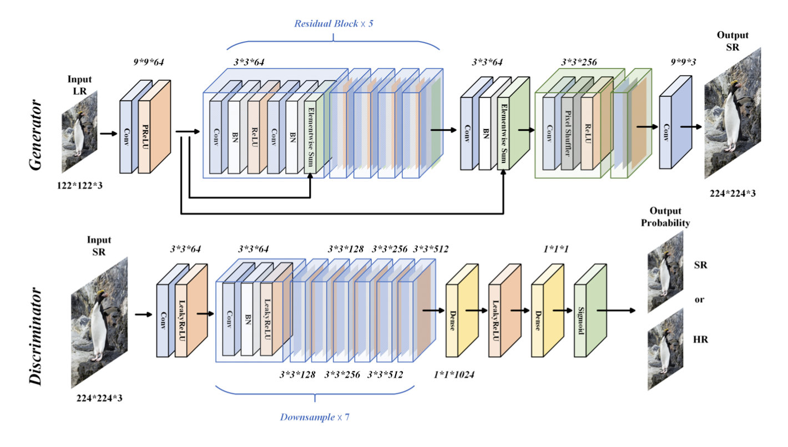

# README.md for EE541 Project

## Project Overview

This project focuses on developing and comparing two Super-Resolution models: SRCNN (Super-Resolution Convolutional Neural Network) and SRGAN (Super-Resolution Generative Adversarial Network). These models aim to upscale low-resolution images to high-resolution while preserving image details.

## Repository Structure

```
EE541_Project_final/
├── model/
│   ├── SRGAN_model.py
│   ├── SRCNN_model.py
│   ├── SRGAN_architecture_image.jpg
│   └── SRCNN_architecture_image.jpg
├── test/
│   ├── test_srgan.py
│   └── test_srcnn.py
├── src/
│   └── data_loader.py
├── utils/
│   ├── evaluate_metrices.py
│   ├── image_display.py
│   ├── plot_srcnn.py
│   └── plot_srgan.py
├── output/
│   ├── plots/
│   │   ├── srcnn_result_plot.png
│   │   └── srgan_result_plot.png
│   ├── images/
│   ├── saved_model_srcnn/
│   ├── saved_model_srgan/
│   └── training_metrices/
├── final_inference.ipynb
└── data/
    ├── DIV2K_train_HR/
    ├── DIV2K_train_LR_bicubic/
    ├── DIV2K_valid_HR/
    ├── DIV2K_valid_LR_bicubic/
    ├── DIV2K_test_HR/
    └── DIV2K_test_LR_bicubic/
```
## Description of Key Files

### Model Files

1. `SRGAN_model.py`: Contains the implementation of the SRGAN model. This script includes the architecture for the generator and discriminator, training process, and evaluation methods.
2. `SRCNN_model.py`: Implements the SRCNN model. It focuses on evaluating the model's performance using metrics like SNR, PSNR, and SSIM.

### Utility Files

1. `evaluate_metrices.py`: Provides functions for calculating SNR, PSNR, and SSIM to evaluate the model's performance.
2. `image_display.py`: A utility to display high-resolution, low-resolution, and output images side by side for visual comparison.
3. `plot_srcnn.py` and `plot_srgan.py`: These scripts generate plots to visualize the training process, including loss and accuracy metrics over epochs.

### Test Files

1. `test_srcnn.py`: Script to evaluate the SRCNN model on a test dataset.
2. `test_srgan.py`: Similar to `test_srcnn.py`, but for evaluating the SRGAN model.

### Inference File

- `final_inference.ipynb`: This Jupyter notebook file is used for running inference on test images using the trained SRCNN and SRGAN models. It includes functions for image loading, preprocessing, postprocessing, and model loading. The notebook also contains code for visualizing high-resolution, low-resolution, and super-resolved images generated by both SRCNN and SRGAN models.

### Data Loader

- `data_loader.py`: Handles loading and preprocessing of high-resolution and low-resolution images for training, validation, and testing.

### Output Directory

- `plots/`: Stores generated plots of training metrics.
- `images/`: Contains output images from the `final_inference.ipynb`.
- `saved_model_srcnn/`: Contains saved state dictionaries of the SRCNN model.
- `saved_model_srgan/`: Contains saved state dictionaries of the SRGAN model.

### Data Directory

- Contains high-resolution and low-resolution images used for training, validation, and testing the models.

### Model Architectures

1. **SRCNN Architecture**: 
2. **SRGAN Architecture**: 

## Running the Models

### Prerequisites

- Python 3.x
- PyTorch
- OpenCV
- Matplotlib
- NumPy
- scikit-image

### Steps to Run

1. **Train the Models**:
   Navigate to the `model` directory and run:
   ```bash
   python SRGAN_model.py
   python SRCNN_model.py
   ```
   This will train the models and save the output models and metrics.

2. **Test the Models**:
   After training, evaluate the models on the test dataset by running:
   ```bash
   python ../test/test_srcnn.py
   python ../test/test_srgan.py
   ```
   This will output the SNR, PSNR, and SSIM metrics for the test dataset.

3. **Visualization**:
   To visualize the final results, use the `final_inference.ipynb` notebook.

## Images and Results

The output directory contains plots and saved models. You can visualize training metrics using the `plot_srcnn.py` and `plot_srgan.py` utilities. The `image_display.py` script can be used to display input and output images for qualitative evaluation.

### Interpreting Results

1. **Loss Curves**: These plots show how the loss decreases over epochs, indicating learning progress.
2. **Accuracy Metrics**: Plots for SNR, PSNR, and SSIM provide insights into the quality of the generated high-resolution images.
3. **Model Comparisons**: By evaluating both models on the same dataset, you can compare their effectiveness in enhancing image resolution.

### Test Results

| Model    | SNR  | PSNR | SSIM  |                                  
|----------|------|------|------------------------------------------------------|
| SRCNN    | 12.05| 18.63| 0.6043| 
| SRGAN    | 13.70| 20.19| 0.5227|
| Bi-cubic | 13.32| 19.90| 0.6595| 

### Training Plots

- SRCNN Training Plot: 
- SRGAN Training Plot: 

### Inference Section

Example of Super-Resolution Output:


## Contributors
- Suhas Somashekar 
- Venkat Tarun Putturu


